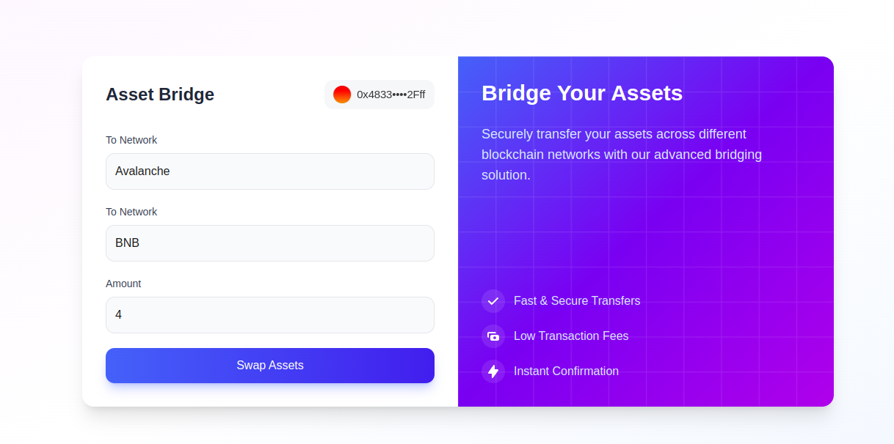

# 🔒🔊 Token Bridge

A 🌐 cross-chain 💳 token bridge enabling seamless 🚪 transfers between the 🌋 Avalanche and 💎 BNB networks. The project consists of ⚖️ smart contracts, an 📊 indexer, and a 💃 React-based frontend, designed for robust and user-friendly cross-chain interactions.

## 🔢 Project Overview

- **⚖️ Smart Contracts**: The `BridgeContract.sol` handles token 🔒 locking on one network and 🔓 unlocking on the other.
- **📊 Indexer**: Monitors contract 📊 events, ⏳ queues and retries transactions, and ensures reliable 🚪 token transfers.
- **💃 Frontend**: A React 🖥️ application with `wagmi` integration for user-friendly interaction with the bridge.

## ✨ Features

- **🌐 Cross-Chain Transfers**: 🔒 Lock tokens on 🌋 Avalanche to release equivalents on 💎 BNB, and vice versa.
- **📊 Event Indexing**: Monitors ⚖️ smart contract 📊 events for accurate and timely token 🚪 transfers.
- **🕹️ Intuitive UI**: Built with 💃 React and `wagmi`, providing both 🔍 read and 🖋 write capabilities for a seamless experience.

## 🎥 Demo Video

[](https://res.cloudinary.com/debysbb33/video/upload/v1730282338/upxzgh6p3yle8ui7ihyc.mp4)

Click the thumbnail above to see the 🔒🔊 Token Bridge in action.

## 🌄 Getting Started

### 🎨 Prerequisites

Before proceeding, ensure you have the following installed:

- **💾 Node.js** (with 🔄 npm or 🎨 yarn)
- **⚖️ Solidity Compiler** (e.g., via 📦 Hardhat or 🌄 Truffle)
- **🌋 Avalanche and 💎 BNB Networks** (configured in your 🔑 wallet)

### 🔒 Installation

1. **🔑 Clone the Repository**:
   ```bash
   git clone https://github.com/iamnas/token-bridge.git
   cd token-bridge
   ```

2. **📋 Install Dependencies**:
   - For the **📊 Indexer**:
     ```bash
     cd indexer
     npm install
     ```
   - For the **💃 Frontend**:
     ```bash
     cd frontend
     npm install
     ```

### 🏛️ Deployment

1. **⚖️ Deploy the Smart Contract**:
   - ✏️ Compile and deploy `BridgeContract.sol` on both 🌋 Avalanche and 💎 BNB networks using your preferred tool (e.g., 📦 Hardhat, 🔜 Remix).
   - Save the deployed 📝 contract addresses for use in the 📊 indexer and 💃 frontend configuration.

2. **📊 Configure the Indexer**:
   - Update the environment 🎨 variables or configuration files in the `indexer` directory with the deployed 📝 contract addresses and ⚖️ RPC URLs.

3. **🚪 Run the Indexer**:
   - Start the 📊 indexer to monitor 📊 events and manage cross-chain 🚪 token transfers.
     ```bash
     cd indexer
     npm run dev
     ```

4. **🔄 Start the Frontend**:
   - Launch the 🕹️ user interface for interacting with the bridge.
     ```bash
     cd frontend
     npm run dev
     ```

## 🕹️ Technologies

The 🔒🔊 Token Bridge leverages the following 🌐 technologies:

- **🌐 Blockchain**: 🌋 Avalanche and 💎 BNB
- **⚖️ Smart Contracts**: 🕹️ Solidity
- **💻 Backend**: 📦 Node.js (📊 Indexer)
- **💃 Frontend**: 🕹️ React with `wagmi`

## 🔄 Future Enhancements

- **🌐 Support for Additional Networks**: Expand compatibility to other 🌐 blockchains.
- **⚖️ Improved Security**: Introduce additional safeguards against potential 🔧 exploits.
- **📈 Advanced User Features**: Add detailed 📊 transaction histories and enhanced 🔄 analytics.

